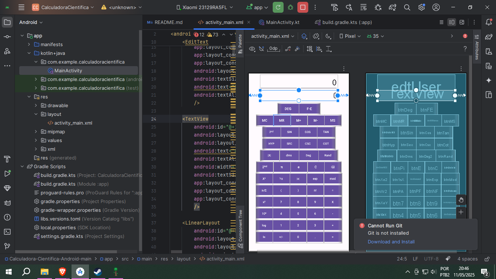

# Calculadora cientifica (Android Studio)

Projeto1 da aula de android studio do curso de ADS


## Requisitos atendidos

- [x] Interface
- [ ] Operações Básicas
- [ ] Operações Cientificas

## Bibliotecas utilizadas

- MxParser

```gradle
dependencies {
    // Outras dependências
    implementation 'org.mariuszgromada.math:mxparser:4.4.0'
}
```


## Exemplo de implementação da biblioteca em java

```java
import android.os.Bundle;
import android.widget.TextView;
androidx.appcompat.app.AppCompatActivity;
import org.mariuszgromada.math.mxparser.Expression;

public class MainActivity extends AppCompatActivity {

    @Override
    protected void onCreate(Bundle savedInstanceState) {
        super.onCreate(savedInstanceState);
        setContentView(R.layout.activity_main);

        // Definindo a expressão matemática
        String expression = "2 + 3 * 5";
        Expression e = new Expression(expression);

        // Calculando o resultado
        double result = e.calculate();

        // Mostrando o resultado na tela
        TextView resultTextView = findViewById(R.id.resultTextView);
        resultTextView.setText("Resultado: " + result);
    }
}

```

## Imagens

